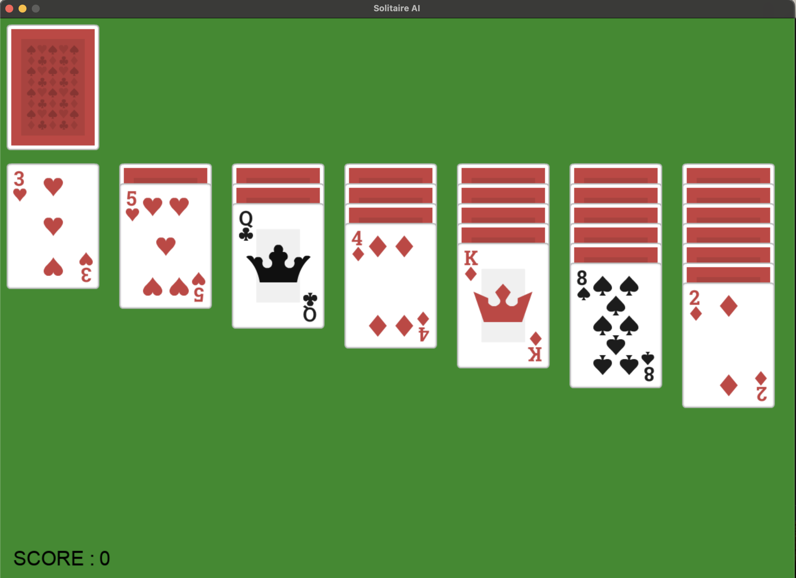
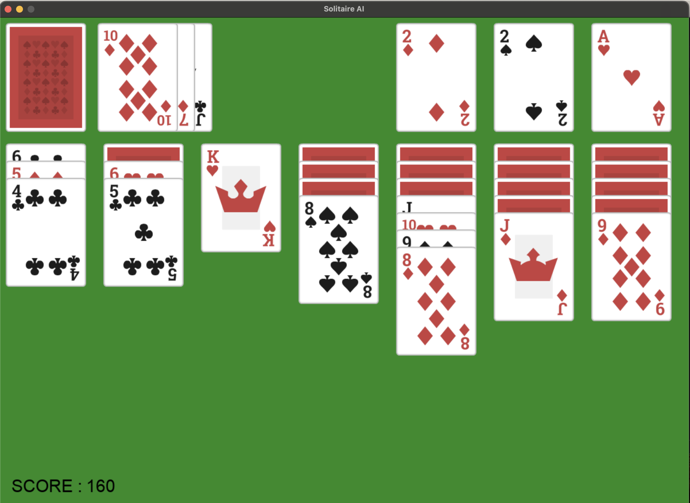

# solitare-ai
Solitaire game. Implemented in Python/Pygame

The game is playable now!

To play, you just have to click on a card and it'll find its way!

Score system : 
- If the player moves a card from the deck to the table, they win 5 points 
- If the player reveals a card from the table, they win 10 points 
- If the player puts a card in the foundation piles, they win 15 points 
- If the player removes a card from a foundation pile, they lose 15 points
- If the player finishes the game, they win 200 points

The AI part of the project is coming soon...

A big thanks to Kenney (Kenney.nl) for their cards !

https://opengameart.org/content/boardgame-pack

